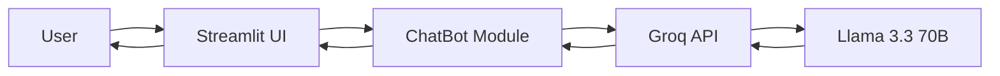

<div align="center">

# AI Chatbot

**A fast, streaming AI chatbot powered by Groq Llama 3.3 and Streamlit**

[](https://www.python.org/)
[](https://streamlit.io/)
[](https://groq.com/)
[](LICENSE)

*Chat with an AI assistant in your browser — real-time responses, session memory, and a clean Python codebase.*

[Features](#-features) · [Demo](#-demo) · [Tech Stack](#-tech-stack) · [Setup](#-installation) · [Usage](#-usage) · [Author](#-author)

</div>

---

## Overview

**AI Chatbot** is a conversational AI web application that connects a Streamlit frontend to the **Groq API** using the **Llama 3.3 70B** model. Users can ask questions, get coding help, brainstorm ideas, and hold natural multi-turn conversations — all with **live streaming responses**.

Built as a **fresher portfolio project**, this repo demonstrates practical skills in Python, LLM API integration, environment-based configuration, and interactive UI development.

---

## Features

| Feature | Description |
|--------|-------------|
| **Streaming replies** | AI responses appear word-by-word in real time |
| **Session memory** | Keeps recent conversation context during a chat session |
| **Groq API** | Fast inference via Groq's OpenAI-compatible endpoint |
| **Streamlit UI** | Modern chat-style web interface |
| **CLI mode** | Optional terminal-based chat for quick testing |
| **Secure config** | API keys stored in `.env`, never committed to Git |

---

## Demo

> Run the app locally and open `http://localhost:8501` in your browser.

```bash
python run.py
```

Screenshots are available in the [`Screenshots/`](Screenshots/) folder.

---

## Tech Stack

<p align="center">
  
  
  
  
  
</p>

---

## Architecture



---

## Project Structure

```
AI_Chatbot-/
├── app.py              # Streamlit web interface
├── chatbot.py          # Chat logic & Groq API calls
├── config.py           # Environment & settings loader
├── run.py              # Launch the web app
├── main.py             # CLI chat mode
├── start.bat           # Windows one-click launcher
├── requirements.txt    # Python dependencies
├── .env.example        # Environment template
└── Screenshots/        # App screenshots
```

---

## Installation

### 1. Clone the repository

```bash
git clone https://github.com/Shiva-Sirimalla/AI_Chatbot-.git
cd AI_Chatbot-
```

### 2. Create a virtual environment

**Windows**
```bash
python -m venv .venv
.venv\Scripts\activate
```

**macOS / Linux**
```bash
python3 -m venv .venv
source .venv/bin/activate
```

### 3. Install dependencies

```bash
pip install -r requirements.txt
```

### 4. Configure environment variables

```bash
copy .env.example .env        # Windows
cp .env.example .env          # macOS / Linux
```

Edit `.env` and add your Groq API key:

```env
GROQ_API_KEY=your-groq-api-key-here
GROQ_MODEL=llama-3.3-70b-versatile
APP_HOST=127.0.0.1
APP_PORT=8501
```

Get a free API key from [console.groq.com](https://console.groq.com).

---

## Usage

### Web App (recommended)

**Windows — double-click**
```
start.bat
```

**Or run manually**
```bash
python run.py
```

Then open in your browser:

```
http://localhost:8501
```

> Keep the terminal window open while using the app.

### CLI Mode

```bash
python main.py
```

| Command | Action |
|---------|--------|
| `/clear` | Clear conversation history |
| `/help` | Show available commands |
| `/quit` | Exit the chatbot |

---

## Environment Variables

| Variable | Description | Default |
|----------|-------------|---------|
| `GROQ_API_KEY` | Your Groq API key | **Required** |
| `GROQ_MODEL` | Groq model name | `llama-3.3-70b-versatile` |
| `APP_HOST` | Server host address | `127.0.0.1` |
| `APP_PORT` | Server port | `8501` |
| `MAX_HISTORY` | Conversation turns to remember | `20` |

---

## What You Can Ask

The chatbot is a general-purpose AI assistant. Try questions like:

- *"Explain Python lists in simple terms"*
- *"Write a function to check if a number is prime"*
- *"Help me write a professional email"*
- *"Give me 5 project ideas for a fresher portfolio"*

---

## Security Notes

- Never commit your `.env` file or API keys to GitHub
- Rotate your API key if it has been exposed
- Use `.env.example` as a template only

---

## Author

**Shiva Sirimalla**

---

<div align="center">

**If you found this project useful, give it a star on GitHub!**

Made with Python, Groq & Streamlit

</div>
